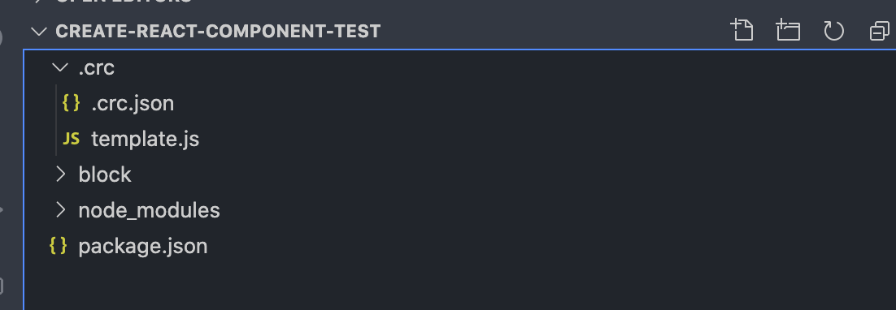

<h1 align="center">
  Create Bulk File
  <br>

</h1>


## Why?

If you ever tired of creating folder/files again and again while developing node application. Then this tool for you. Simply init your file first time and create folder using cli. It's that easy

## Install

The easiest way to use Create bulk files is to install it globally as a
Node command line program. Run the following command in Terminal:

```bash
$ npm install create-bulk-file --global

or 

$ yarn global add create-bulk-file
```

Or, you can install `create-bulk-file` locally, for use in a single project:

```bash
$ npm install create-bulk-file --save-dev

or 

$ yarn add create-bulk-file --dev
```

**Note:** If you find issue installing this package try with `yarn` or else report bug

*Note: To run the preceding commands, [Node.js](http://nodejs.org) /  [npm](https://npmjs.com) or [yarn](https://yarnpkg.com/) must be installed.*

## Usage and examples

After you've installed `create-bulk-file`, you should be able to use the `create-bulk-file` or `cf` (**alias**) program. 

```bash
$ cf block

✔ Files created successfully
```

You can also pass **path as an option** where you want to generate these files

```bash
cf block3 --path=./test/test2
```
It will generate files like this:

```bash
├── test
│   ├── test2
│       ├── block3
│       │   ├── **/*.css
│       │   ├── **/*.js
```

(**Note**: Path must be relative to existing project. For example in above example `block3` is created inside test2 folder )


### Options

* `--path or -p` : Path where these bulk files are installed . [**Default**: `./`]

### How it works?

1. When you use this cli first time it will ask for some basic config for creating config file.
 
**Note**: If you dont want to use default config. I would suggest still do this you can update later. Let it create config and template file.
2. Once its done. It creates `.crc` inside it has two files which is required for this module to use.

Also you see your folder with the files which you input for.


### Advance Usage(extending configuration)

When I started creating this package I was only designing for react specific. Later I realized it can be done for any node js application. So its not only react focus!
* If you dont want to prompt from cli and want your specific file. You can do that also easily
  1. Simply create `.crc` folder in project directory.
  2. It required two files: `.crc.json` and `template.js`. (**Note**: It's case senstive. Do check filename twice)
  3. `.crc.json`:  It just a json file with key value pair
        ```json
            {
                <file type>: <file extension>
            }
        ```
        For example: If you want to add files for `vue js` and its extension would be `.vue`. you can simply do this like this:

        ```json
            {
                "vue":".vue"
            }
        ```
        **Note:** It's not required rule. I feel comfortable doing this. You can choose your key value pair. **Just make sure you map correct in `template.js` file.**
    4. `template.js`: I would recommend to add this file as well. When running this package first time. It will also create this file. This file represent what should content should be rendered on your respective file. Its kind of template you want to render. Just like `snippets`. By default it will empty string except for `jsx`. That I do for demo how it works . So considering above example:

        ```js
            exports[<file type>] = (filename) => //Your content which you want to render when this file generated
        ```

        for above case:

        ```js
            exports["vue"] = (filename) => `//Vue file generated`
        
        ```

        


### Commit conventions

```
<type>(<scope?>): <subject>
<BLANK LINE>
<body?>
<BLANK LINE>
<footer?>

```

More reference you can read [here](https://www.conventionalcommits.org/en/v1.0.0/)

### Reference

- [Emoji commit](https://gitmoji.carloscuesta.me/)
